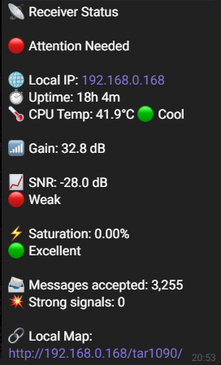

# ADS-B Telegram Bot

Lightweight Telegram bot for Raspberry Pi users running PiAware, dump1090-fa, or readsb. It reads local JSON data only and keeps setup simple.

## Features

- Live aircraft tracking from local JSON output
- Closest aircraft summary with distance and altitude
- Receiver health in plain language
- SNR monitoring
- Saturation monitoring
- CPU temperature display
- Uptime display
- Local IP display
- tar1090 quick link
- Version information

### Status


### Status



## Create Your Telegram Bot

Before installing the bot on your Raspberry Pi, you need a Telegram bot token. That sounds serious, but it is actually the fun part.

1. Open Telegram on your phone or desktop.
2. Search for `@BotFather`.
3. Start a chat with BotFather and send `/newbot`.
4. Give your bot a friendly display name, like `ADS-B Monitor`.
5. Choose a username for the bot. It must end with `bot`, such as `adsb_monitor_bot`.
6. BotFather will reply with a long token. Keep it safe. That token is the key to your bot’s life.
7. Start a chat with your new bot and press Start. This confirms that Telegram created it correctly.

If you want your bot to feel more polished, you can also use BotFather later to set a profile picture, description, and commands. None of that is required for this project, but it is nice extra flavor.

## Find Your Chat ID

This bot only responds to one chat, so you need your `CHAT_ID`.

1. Open a chat with your new bot.
2. Send any message, like `hello`.
3. The easiest way is to use Telegram Web in your browser.
4. Open `https://web.telegram.org` and connect your Telegram account.
5. Open your bot chat, or create a chat with your bot if it does not exist yet.
6. Look at the URL in the browser. It will look like `https://web.telegram.org/a/#-1234567890`.
7. The number after `#` is your chat ID. In this example, the chat ID is `-1234567890`.
8. Put that number into `config.py`.

Only messages from that chat will be accepted.

## Install the Bot

Once you have the token and chat ID, install the bot on the Raspberry Pi.

```bash
curl -sSL https://raw.githubusercontent.com/bersuc/adsb-telegram-bot/main/install.sh?ref=install | sudo bash
```

The installer downloads `bot.py` and `config.py`, then creates the service.

## Configuration

Edit `config.py` with:

- `TOKEN`
- `CHAT_ID`
- `LAT_ANTENA`
- `LON_ANTENA`
- `BOT_NAME`
- `DISTANCE_UNIT`

Distance units are set manually with `DISTANCE_UNIT = "km"` or `DISTANCE_UNIT = "miles"`.

Version is defined in `bot.py` and updated with the bot release.

## Commands

- `/radar` - Show live aircraft and the closest flight
- `/status` - Show receiver health and system status
- `/about` - Show bot and command information

## Update

```bash
curl -sSL https://raw.githubusercontent.com/bersuc/adsb-telegram-bot/main/update.sh?ref=update | sudo bash
```

## Example Config

If you want a starting point, copy `config.example.py` to `config.py` and edit the values for your station.
