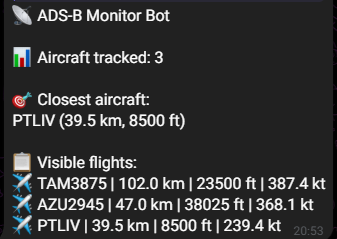

# ADS-B Telegram Bot

**Real-time Aircraft Monitoring for your Telegram** 🛰️✈️

A clean, fast and lightweight Telegram bot designed for **PiAware + dump1090-fa / readsb** users.



### Why users love it

- See live aircraft count
- Know exactly which plane is closest to your antenna (with distance)
- Beautiful and clean flight summary
- Accurate distance calculation (Haversine)
- Very easy to install and use

### Features

- Real-time monitoring using your local dump1090-fa
- Highlights the closest aircraft
- Supports **km** and **miles** (configurable)
- Clean Markdown formatting
- Actively maintained with regular updates
- Easy one-command installation

### Quick Install

```bash
curl -sSL https://raw.githubusercontent.com/bersuc/adsb-telegram-bot/main/install.sh?ref=install | sudo bash
```
